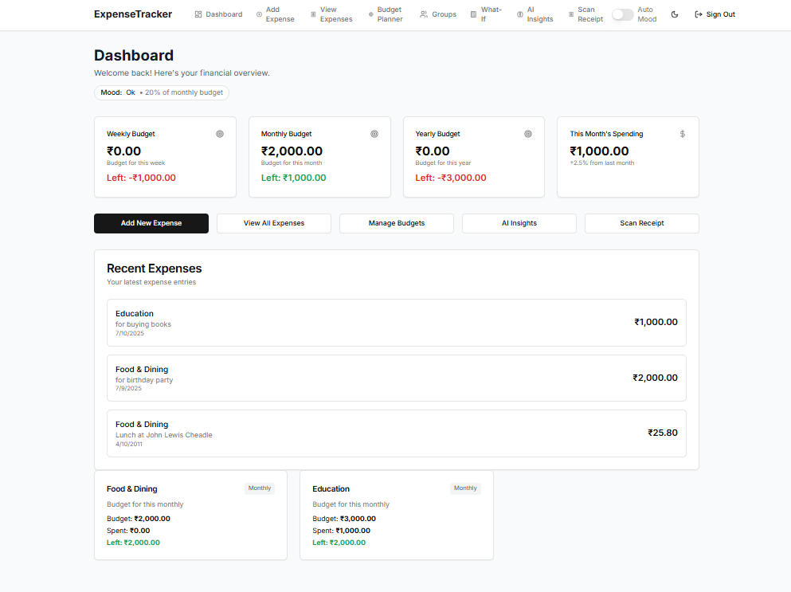
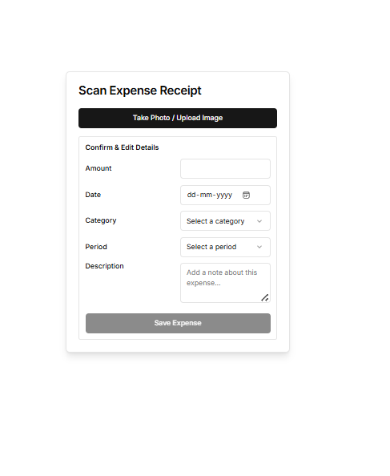
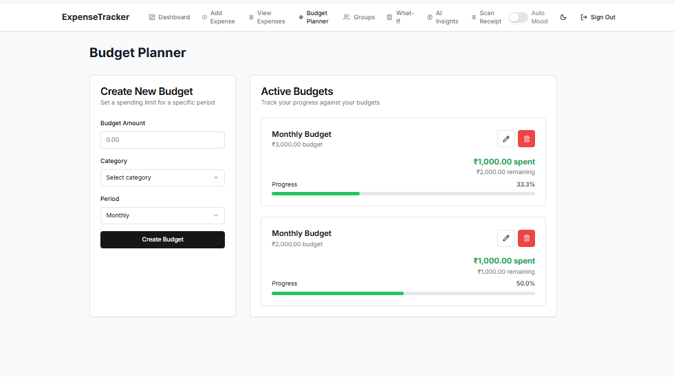
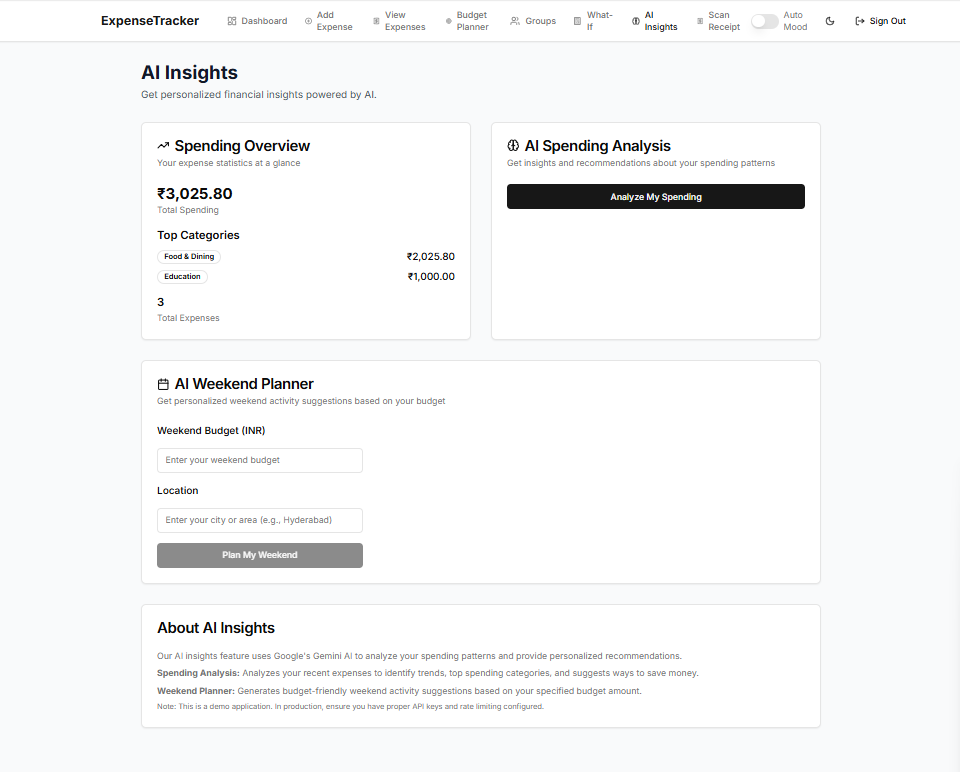
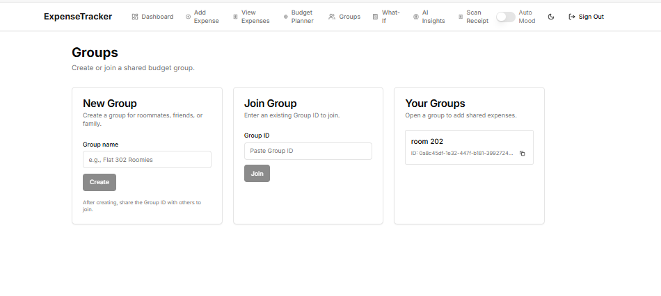

<!-- AIGNITE Banner (centered) -->
<div align="center">
  <h1> AIGNITE 2K25</h1>
  <p><strong>Powered by MLSC</strong></p>
</div>

---

<p align="center">
  <strong>🚀 ExpenseTracker</strong><br/>
  <em>Smart Finance Management with AI-Powered Insights</em>
</p>

---

## 📖 Project Description
✨ **Problem Statement:** Managing personal finances is challenging for many people. Users struggle with tracking expenses, setting realistic budgets, understanding spending patterns, and making informed financial decisions. Traditional expense tracking apps lack intelligent insights and scenario planning capabilities.

💡 **Proposed Solution:** ExpenseTracker is a comprehensive personal finance management application that combines traditional expense tracking with AI-powered insights. It features smart budget planning, receipt scanning with OCR, What-If scenario simulation, shared budget groups, and dynamic mood-based themes that adapt to spending patterns.

🎯 **Target Users / Use Cases:** 
- **Individuals** seeking better financial control and spending awareness
- **Students** managing limited budgets and expenses
- **Families** tracking shared expenses and budgets
- **Professionals** wanting AI-driven financial insights
- **Anyone** looking to improve their financial habits and savings

---

## 🔬 Methodology
1. **Research & Ideation** – Analyzed pain points in personal finance management and identified opportunities for AI integration.

2. **Design** – Created intuitive UI/UX with mobile-first responsive design, implemented dark/light themes with dynamic mood-based theming.

3. **Develop** – Built core features including expense tracking, budget management, AI insights, receipt scanning, What-If simulator, and shared groups.

4. **Test** – Conducted comprehensive testing across devices, implemented error handling, and validated all user flows.

5. **Deploy** – Configured for production deployment with proper environment variables and database setup.

6. **Future Scope** – Advanced analytics, investment tracking, bill reminders, and enhanced AI recommendations.

---

## 👥 Team Details
**Team Name:** `Team Visons`

| Name | Role | Email |
|---|---:|---|
| Sathvik chandra | Team Lead | sathvikchandra123@gmail.com |
| Saisrikar | Team Member | 2311CS030246@mallareddyuniversity.ac.in|
| Tarun | Team Member | 2311CS020542@mallareddyuniversity.ac.in |
| Nagesh | Team Member   | 2311CS020576@mallareddyuniversity.ac.in |

---

## 🛠️ Technology Stack
`Next.js 13.5` | `TypeScript` | `Supabase` | `TailwindCSS` | `Google Gemini AI` | `OCR.Space API` | `React` | `PostgreSQL`

### **Frontend:**
- **Next.js 13.5** - React framework with App Router
- **TypeScript** - Type-safe development
- **TailwindCSS** - Utility-first CSS framework
- **shadcn/ui** - Modern component library
- **React Hook Form** - Form management
- **Recharts** - Data visualization

### **Backend:**
- **Supabase** - Backend-as-a-Service (Auth, Database, RLS)
- **PostgreSQL** - Relational database
- **Row Level Security** - Data protection

### **AI & External APIs:**
- **Google Gemini AI** - Spending analysis and insights
- **OCR.Space API** - Receipt text extraction

### **Deployment:**
- **Vercel** - Frontend hosting
- **Supabase Cloud** - Database hosting

---

## 📹 Demonstration Video
▶️ [Part 1 - https://www.loom.com/share/32e1d1ae04774b4bb1e65d36c5953e81?sid=04b89c26-8fc3-4b2e-98b0-180b13ffe3c8]
▶️ [Part 2 - https://www.loom.com/share/26bddd0509ae4f739921af37a4f04c09?sid=6deef484-3d73-43a4-a229-2c10273d72a1]
---

## 🌐 Deployment
🔗 [https://indiabudgetbuddy.vercel.app/]

### **Local Development:**
   ```bash
# Clone the repository
git clone [https://github.com/Saisrikar-Kokku/Take-Control-of-Your-Financial-Future.git]

# Install dependencies
   npm install

# Set up environment variables
cp .env.example .env.local

# Run development server
   npm run dev
   ```

### **Environment Variables Required:**
```env
NEXT_PUBLIC_SUPABASE_URL=your_supabase_url
NEXT_PUBLIC_SUPABASE_ANON_KEY=your_supabase_key
GEMINI_API_KEY=your_gemini_api_key
OCR_SPACE_API_KEY=your_ocr_space_api_key
```

---

## 🚀 Key Features

### **Core Functionality:**
- ✅ **Expense Tracking** - Add, edit, delete expenses with categories
- ✅ **Budget Management** - Set and track weekly/monthly/yearly budgets
- ✅ **Receipt Scanning** - OCR-powered receipt text extraction
- ✅ **AI Insights** - Smart spending analysis and recommendations
- ✅ **What-If Simulator** - Scenario planning with goal backsolver
- ✅ **Shared Groups** - Collaborative budget management
- ✅ **Dynamic Themes** - Mood-based UI themes (OK/Watch/Overspend)

### **Advanced Features:**
- 🔄 **Auto-Mood System** - UI adapts based on spending patterns
- 📱 **Mobile Responsive** - Optimized for all device sizes
- 🌙 **Dark/Light Mode** - User preference themes
- 🔐 **Secure Authentication** - Supabase Auth with RLS
- 📊 **Visual Analytics** - Charts and progress indicators
- 🎯 **Goal Tracking** - Financial goal setting and monitoring

---

## 📚 References
- [Next.js Documentation](https://nextjs.org/docs)
- [Supabase Documentation](https://supabase.com/docs)
- [TailwindCSS Documentation](https://tailwindcss.com/docs)
- [Google Gemini AI API](https://ai.google.dev/docs)
- [OCR.Space API Documentation](https://ocr.space/ocrapi)

---

## 🖼️ Assets / Screenshots

### **Dashboard Overview**
<p align="center">
  
  <br/>
  <em>Main dashboard showing budget overview, recent expenses, and quick actions</em>
</p>

### **Receipt Scanning Feature**
<p align="center">
  
  <br/>
  <em>AI-powered receipt scanning with OCR text extraction and automatic form filling</em>
</p>

### **Budget Management**
<p align="center">
  
  <br/>
  <em>Budget creation and tracking with visual progress indicators</em>
</p>

### **AI Insights & Analysis**
<p align="center">
  
  <br/>
  <em>AI-powered spending analysis and personalized financial recommendations</em>
</p>

### **Shared Groups Feature**
<p align="center">
  
  <br/>
  <em>Collaborative budget management for roommates, families, and friends</em>
</p>


---

## 🏆 Project Highlights

### **Innovation:**
- **AI-Powered Insights** - Intelligent spending analysis using Google Gemini
- **Dynamic Mood Themes** - UI that adapts to financial health
- **What-If Scenario Planning** - Advanced financial simulation
- **Smart Receipt Processing** - OCR + AI extraction

### **Technical Excellence:**
- **Type-Safe Development** - Full TypeScript implementation
- **Mobile-First Design** - Responsive across all devices
- **Secure Architecture** - Row Level Security with Supabase
- **Modern Tech Stack** - Latest Next.js with App Router

### **User Experience:**
- **Intuitive Interface** - Clean, modern design
- **Real-time Updates** - Live data synchronization
- **Accessibility** - WCAG compliant components
- **Performance** - Optimized loading and rendering

---

<p align="center">
  <b>Hackathon:</b> AIGNITE 2K25 | Organized by MLSC<br/>
  <b>Project:</b> ExpenseTracker - Smart Finance Management<br/>
  <b>Status:</b> ✅ Production Ready
</p>